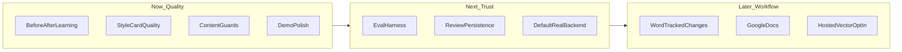

# Product Roadmap

Demo-first, quality-led plan for contributors. Distribution and SaaS stay deferred until review quality is credible.

| Decision | Choice |
|---|---|
| Distribution (6–12 mo) | **Demo / portfolio / research artifact** — polish the story; defer multi-user and SaaS |
| North star | **Review quality** — suggestions feel like *this* professor; fewer false “content” edits |

**Product promise:** grounded scientific writing review from the professor’s own corpus — improves wording, clarity, structure, and terminology; **flags** unsupported claims; never invents science.

**Out of scope for now:** lab auth / multi-user, SaaS, hosted vector DB, Google Docs. Word tracked-changes comes later, after quality is solid.

---

## Current baseline (v1)

Ships today:

- Corpus ingest → local Chroma RAG → style card → section review
- Outputs: `reviewed.docx` + `suggestions.md`, or web Accept/Skip → clean export
- Cursor skill/command: `/review-paper`
- Backends: `mock` / `local` / `gemini` / `api`

**Highest-leverage gap:** [`data/examples/`](../data/examples/README.md) documents before/after pairs that teach editing decisions, but nothing in the review path reads those pairs yet (`examples_dir` is config-only).

---

## Horizon 0 — Demo credibility (1–2 weeks)

Goal: a 5-minute path that looks and sounds like a real professor review.

| Item | Why | Where |
|---|---|---|
| Fix / ship sample paper script | [`example_paperworks/README.md`](../example_paperworks/README.md) references missing `scripts/make_sample_paper.py` | `scripts/` |
| Golden-path demo pack | Matched professor paper + weak student draft + expected suggestion themes | `example_paperworks/`, README |
| Backend honesty in demos | Default `mock` is heuristic-only; quality demos need `local` / `gemini` / `api` | `web/index.html`, README |
| Cursor skill polish | `/review-paper` as the portfolio demo surface | `.cursor/skills/review-paper/` |

**Success metric:** cold clone → ingest sample → review sample → Accept/Skip → export, with clearly corpus-grounded terminology (not mock fluff).

---

## Horizon 1 — Professor voice (4–8 weeks) — priority build

Goal: suggestions measurably closer to how *this* professor edits.

### 1. Wire before/after learning (core)

- Ingest pairs from `data/examples/` (`*.before.docx` / `*.after.docx`)
- Diff → extract edit patterns (phrase swaps, hedging, section habits)
- Feed into style card rebuild and/or few-shot retrieval at review time
- CLI: extend `profa style` (or add `profa examples`) so demos can rebuild from pairs

Primary code: `src/professor_assistant/style.py`, `review.py`, `config.py`, `prompts/`

### 2. Style card quality loop

- Regenerate style card from corpus **+** examples
- Tighten prompts so terminology/phrasing prefer retrieved professor passages
- Surface “grounded in: [paper chunk]” in `suggestions.md` / web (demo trust signal)

### 3. Content-safety / false-positive reduction

- Stricter rules for `content` severity: flag-only, never silent rewrite of claims
- Reduce language-as-content misfires via section rules + severity calibration
- Prompt/tests around “unsupported claim” vs “awkward wording”

**Success metrics:**

- Side-by-side: same draft, corpus-only vs corpus+examples → higher “sounds like him” score
- Lower rate of `content` suggestions that change scientific meaning
- Demo narrative: “trained on papers *and* how he actually edits students”

---

## Horizon 2 — Measurable quality + durable demos

Once voice learning exists, make quality provable and demos repeatable.

| Item | Why |
|---|---|
| Tiny eval harness | Fixed draft set + golden expectation themes; score retrieval hit / severity mix / “no invented facts” |
| Persist web reviews | Replace in-memory `_REVIEWS` so Accept/Skip survives restart (`api.py`) |
| Recommended backend path | Documented “demo quality” profile (Gemini free or Ollama) so mock isn’t the silent default in demos |
| Optional accept feedback | Log Accept/Skip → weak preference signal for future ranking (still local files) |

**Success metric:** rerun eval after prompt/style changes without manual eyeballing every time.

---

## Horizon 3 — Workflow & distribution (parked)

Only after quality is demo-credible:

- Native Word tracked changes / margin comments
- Google Docs API
- Opt-in hosted vector store (Chroma Cloud / Qdrant Cloud; local remains default)
- Multi-user / auth / SaaS — revisit only after a real professor adopts the local tool

---

## Build order

1. **Demo pack + backend honesty** (Horizon 0) — unblocks storytelling now
2. **Before/after learning + style card** (Horizon 1.1–1.2) — main quality bet
3. **Content guards** (Horizon 1.3) — protects the “never invent science” brand
4. **Eval harness + review persistence** (Horizon 2) — makes iteration safe
5. **Word comments** (Horizon 3) — only when Accept/Skip is the bottleneck

---

## Explicit non-goals (for now)

- No auth, multi-tenant lab, or cloud product surface
- No hosted Chroma/Qdrant as a near-term milestone
- No broad domain expansion beyond the current nanoscience framing until voice quality is solid for one professor

---

## How to contribute against this roadmap

Prefer PRs that advance the current horizon (0 → 1 → 2). If you propose Horizon 3 work, say why quality is already good enough that workflow is the bottleneck.

Questions or proposals: open an issue and link the horizon item you are targeting.
